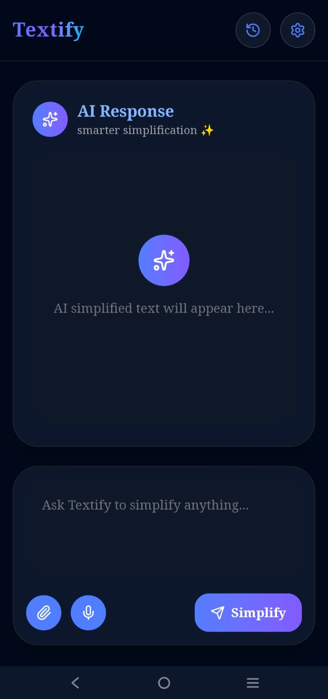

# ✨ Textify AI

Textify AI is an AI-powered web application that simplifies complex text into easy-to-understand notes using modern AI technologies.

Built with Next.js, Supabase, and a beautiful responsive UI supporting both Light Mode and Dark Mode.

---

## 🚀 Features

- ✍️ Simplify complex text into readable notes
- 🎤 Voice-to-text input using speech recognition
- 🖼️ Image OCR support using Tesseract.js
- 📄 PDF text extraction
- 🧠 AI-generated simplified responses
- 🕘 History page with saved notes
- 🌙 Light & Dark mode support
- 🔐 Authentication with:
  - Email & Password
  - Google OAuth
- 📱 Fully responsive modern UI

---

## 🛠️ Tech Stack

Frontend

- Next.js
- TypeScript
- Tailwind CSS

Backend & Database

- Supabase

AI & Utilities

- Tesseract.js
- react-speech-recognition

---

## 📸 Screenshots

Add your screenshots here ✨

---

## ⚙️ Environment Variables

Create a ".env.local" file and add:

NEXT_PUBLIC_SUPABASE_URL=your_supabase_url
NEXT_PUBLIC_SUPABASE_ANON_KEY=your_supabase_anon_key

---

## 🔒 Security

This project uses:

- Supabase Authentication
- Row Level Security (RLS)
- Protected user-specific history data

«The public anon key is safe to expose only when proper RLS policies are enabled.»

---

## 📂 Installation

Clone the repository:

git clone https://github.com/your-username/textify-ai.git

Go into the project folder:

cd textify-ai

Install dependencies:

npm install

Run the development server:

npm run dev

---

## 🌐 Deployment

This project is deployed using:

- Vercel
- Supabase

---

## 💡 Future Improvements

- Multi-language support
- Export notes as PDF
- AI chat assistant
- Notes categorization
- Summarization levels

---

## 👩‍💻 Author

Built by Srilekha

---

## ⭐ Support

If you like this project, consider giving it a ⭐ on GitHub.
